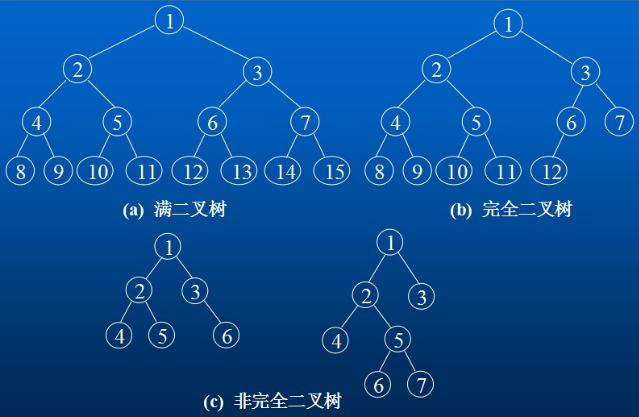
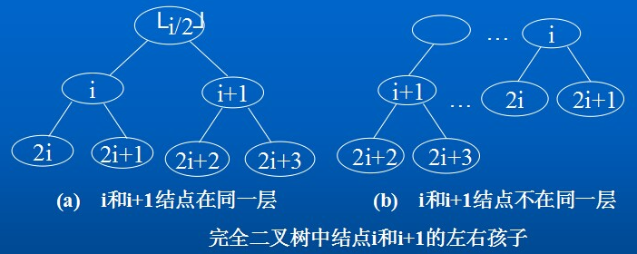
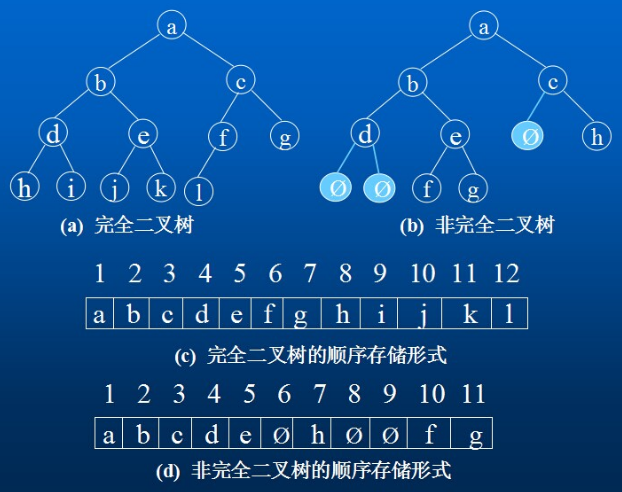
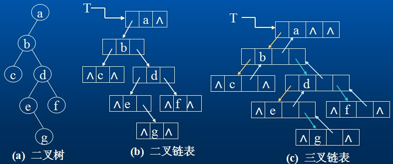
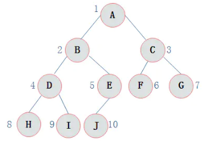
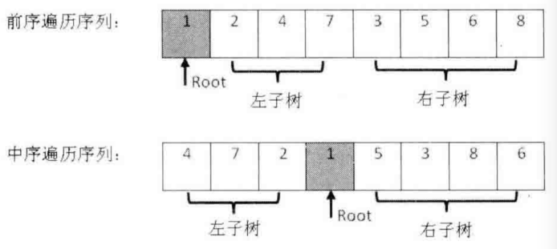

# 数据结构  
 
数据结构是数据元素相互之间存在一种或多种特定关系的集合。“结构”就是指数据元素之间存在的关系，分为逻辑结构和存储结构。  

工程师将实际问题转化为计算机指令的方法就是设计出数据结构，再施加以算法就行。  

## 一、逻辑结构  

简单的来说逻辑结构就是数据之间的关系，逻辑结构大概统一的可以分成两种：线性结构、非线性结构。  

线性结构：是一个有序数据元素的集合。 其中数据元素之间的关系是一对一的关系，即除了第一个和最后一个数据元素之外，其它数据元素都是首尾相接的。常用的线性结构有: 栈，队列，链表，线性表。  

非线性结构：各个数据元素不再保持在一个线性序列中，每个数据元素可能与零个或者多个其他数据元素发生联系。常见的非线性结构有 二维数组，树等。  

## 二、存储结构  

存储结构是逻辑结构用计算机语言的实现，常见的存储结构有顺序存储、链式存储、索引存储以及散列存储。  
+ 数组在内存中的位置是连续的，它就属于顺序存储；  
+ 链表是主动建立数据间的关联关系的，在内存中却不一定是连续的，它属于链式存储；  
+ 顺序和逻辑上都不存在顺序关系，但是可以通过一定的方式去访问它的哈希表，数据散列存储。  

## 三、树  

### 1. 定义  

树是一种非线性的数据结构，是n（n>=0)个结点的有限集。n=0时称为空树。在任意一颗非空树中：  
+ 有且仅有一个特定的称为根（Root）的结点；  
+ 当n>1时，其余结点可分为m(m>0)个互不相交的有限集T1、T2、…、Tn，其中每一个集合本身又是一棵树，并且称为根的子树。因此，树是递归定义的。  

    

**节点的度** ： 一个节点含有的子树的个数称为该节点的度； 如上图： A的为6，B的为0，D的为1。  
**叶节点或终端节点** ： 度为0的节点称为叶节点； 如上图： B、 C、 H、 I...等节点为叶节点 非终端。  
**节点或分支节点** ： 度不为0的节点。  
**双亲节点或父节点** ： 若一个节点含有子节点，则这个节点称为其子节点的父节点； 如上图： A是B的父节点。  
**孩子节点或子节点** ： 一个节点含有的子树的根节点称为该节点的子节点； 如上图： B是A的孩子节点。  
**兄弟节点** ： 具有相同父节点的节点互称为兄弟节点； 如上图： B、 C是兄弟节点。  
**树的度** ： 一棵树中，最大的节点的度称为树的度； 如上图：树的度为6。  
**节点的层次** ： 从根开始定义起，根为第1层，根的子节点为第2层，以此类推。  
**树的高度或深度** ： 树中节点的最大层次； 如上图：树的高度为4。  
**堂兄弟节点** ： 双亲在同一层的节点互为堂兄弟；如上图： H、 I互为兄弟节点。  
**节点的祖先** ： 从根到该节点所经分支上的所有节点；如上图： A是所有节点的祖先。  
**子孙** ： 以某节点为根的子树中任一节点都称为该节点的子孙。如上图：所有节点都是A的子孙。  
**森林** ： 由m（m>0）棵互不相交的树的集合称为森林。  

**树的表示** ： 树结构相对线性表比较复杂，存储表示起来比较麻烦，既然保存值域，也要保存结点和结点之间的关系。树有很多种表示方式如：双亲表示法，孩子表示法、孩子双亲表示法以及孩子兄弟表示法等。  

### 2. 双亲表示法(顺序存储结构)

优点：parent(tree, x)操作可以在常量时间内实现 

缺点：求结点的孩子时需要遍历整个结构  

用一组连续的存储空间来存储树的结点，同时在每个结点中附加一个指示器(整数域) ，用以指示双亲结点的位置(下标值) 。  

  

图所示是一棵树及其双亲表示的存储结构。这种存储结构利用了任一结点的父结点唯一的性质。可以方便地直接找到任一结点的父结点，但求结点的子结点时需要扫描整个数组。  

```javascript
// 1.双亲表示法
// 优点：parent(tree, x)操作可以在常量时间内实现
// 缺点：求结点的孩子时需要遍历整个结构
function ParentTree() {
    this.nodes = [];
}
ParentTree.prototype = {
    constructor: ParentTree,
    getDepth: function () {
        var maxDepth = 0;

        for (var i = 0; i < this.nodes.length; i++) {
            var dep = 0;
            for (var j = i; j >= 0; j = this.nodes[i].parent) dep++;
            if (dep > maxDepth) maxDepth = dep;
        }

        return maxDepth;
    }
};
function ParentTreeNode(data, parent) {
    // type: ParentTree
    this.data = data || null;
    // 双亲位置域 {Number}
    this.parent = parent || 0;
}
var pt = new ParentTree();
pt.nodes.push(new ParentTreeNode('R', -1));
pt.nodes.push(new ParentTreeNode('A', 0));
pt.nodes.push(new ParentTreeNode('B', 0));
pt.nodes.push(new ParentTreeNode('C', 0));
pt.nodes.push(new ParentTreeNode('D', 1));
pt.nodes.push(new ParentTreeNode('E', 1));
pt.nodes.push(new ParentTreeNode('F', 3));
pt.nodes.push(new ParentTreeNode('G', 6));
pt.nodes.push(new ParentTreeNode('H', 6));
pt.nodes.push(new ParentTreeNode('I', 6));
```  

### 3. 孩子链表表示法 

树中每个结点有多个指针域，每个指针指向其一棵子树的根结点。有两种结点结构。  

#### 3.1 定长结点结构  

指针域的数目就是树的度。  

其特点是：链表结构简单，但指针域的浪费明显。结点结构如图所示。在一棵有n个结点，度为k的树中必有n(k-1)+1空指针域。  
        
  

#### 3.2 不定长结点结构  
  
树中每个结点的指针域数量不同，是该结点的度，如图所示。没有多余的指针域，但操作不便。  
        
  

#### 3.3 复合链表结构  

对于树中的每个结点，其孩子结点用带头结点的单链表表示，表结点和头结点的结构如图所示。  
n个结点的树有n个(孩子)单链表(叶子结点的孩子链表为空)，而n个头结点又组成一个线性表且以顺序存储结构表示。  

  

  

```javascript
function ChildTree() {
    this.nodes = [];
}
ChildTree.prototype = {
    constructor: ChildTree,
    getDepth: function () {
        var self = this;
        return function subDepth(rootIndex) {
            if (!self.nodes[rootIndex]) return 1;

            for (var sd = 1, p = self.nodes[rootIndex]; p; p = p.next) {
                var d = subDepth(p.child);
                if (d > sd) sd = d;
            }

            return sd + 1;
        }(this.data[0]);
    }
};
/**
*
* @param {*} data
* @param {ChildTreeNode} firstChild 孩子链表头指针
* @constructor
*/
function ChildTreeBox(data, firstChild) {
    this.data = data;
    this.firstChild = firstChild;
}
/**
* 孩子结点
*
* @param {Number} child
* @param {ChildTreeNode} next
* @constructor
*/
function ChildTreeNode(child, next) {
    this.child = child;
    this.next = next;
}
```  

孩子表示法便于涉及孩子的操作的实现，但不适用于parent操作。  

### 4. 孩子兄弟表示法(二叉树表示法)

以二叉链表作为树的存储结构。  

  

两个指针域：分别指向结点的第一个子结点和下一个兄弟结点。结点类型定义如下：  

```javascript
// 孩子兄弟表示法(二叉树表示法)
// 可增设一个parent域实现parent操作
// 伪代码
function ChildSiblingTree(data, firstChild, nextSibling) {
    this.data = data || null;
    this.firstChild = firstChild || null;
    this.nextSibling = nextSibling || null;
}
ChildSiblingTree.prototype = {
    constructor: ChildSiblingTree,
    // 输出孩子兄弟链表表示的树的各边
    print: function print() {
        for (var child = this.firstChild; child; child = child.nextSibling) {
            console.log('%c %c', this.data, child.data);
            print.call(child);
        }
    },
    // 求孩子兄弟链表表示的树的叶子数目
    leafCount: function leafCount() {
        if (!this.firstChild) return 1;
        else {
            var count = 0;
            for (var child = this.firstChild; child; child = child.nextSibling) {
                count += leafCount.call(child);
            }
            return count;
        }
    },
    // 求树的度
    getDegree: function getDegree() {
        if (!this.firstChild) return 0;
        else {
            var degree = 0;
            for (var p = this.firstChild; p; p = p.nextSibling) degree++;

            for (p = this.firstChild; p; p = p.nextSibling) {
                var d = getDegree.call(p);
                if (d > degree) degree = d;
            }

            return degree;
        }
    },
    getDepth: function getDepth() {
        if (this === global) return 0;
        else {
            for (var maxd = 0, p = this.firstChild; p; p = p.nextSibling) {
                var d = getDepth.call(p);
                if (d > maxd) maxd = d;
            }

            return maxd + 1;
        }
    }
};
```  

### 5. 森林与二叉树的转换

由于二叉树和树都可用二叉链表作为存储结构，对比各自的结点结构可以看出，以二叉链表作为媒介以导出树和二叉树之间的一个对应关系。  

1. 从物理结构来看，树和二叉树的二叉链表是相同的，只是对指针的逻辑解释不同而已。  
2. 从树的二叉链表表示的定义可知，任何一棵和树对应的二叉树，其右子树一定为空。  
  
  

#### 5.1 树转换成二叉树  

对于一般的树，可以方便地转换成一棵唯一的二叉树与之对应。将树转换成二叉树在“孩子兄弟示法”中已给出，其详细步骤是：  

1. 加虚线。在树的每层按从“左至右”的顺序在兄弟结点之间加虚线相连。  
2. 去连线。除最左的第一个子结点外，父结点与所有其它子结点的连线都去掉。  
3. 旋转。将树顺时针旋转450，原有的实线左斜。  
4. 整型。将旋转后树中的所有虚线改为实线，并向右斜。  
        


#### 5.2 二叉树转换成树  
        
对于一棵转换后的二叉树，如何还原成原来的树? 其步骤是：  

1. 加虚线。若某结点i是其父结点的左子树的根结点，则将该结点i的右子结点以及沿右子链不断地搜索所有的右子结点，将所有这些右子结点与i结点的父结点之间加虚线相连，如下图a所示。  
2. 去连线。去掉二叉树中所有父结点与其右子结点之间的连线，如下图b所示。  
3. 规整化。将图中各结点按层次排列且将所有的虚线变成实线，如下图c所示。  
        
  

#### 5.3 森林转换成二叉树  
        
当一般的树转换成二叉树后，二叉树的右子树必为空。若把森林中的第二棵树(转换成二叉树后)的根结点作为第一棵树(二叉树)的根结点的兄弟结点，则可导出森林转换成二叉树的转换算法如下：   

设F={T1, T2,⋯,Tn}是森林，则按以下规则可转换成一棵二叉树B=(root，LB，RB)  

1. 若n=0，则B是空树。  
2. 若n>0，则二叉树B的根是森林T1的根root(T1)，B的左子树LB是B(T11,T12, ⋯,T1m) ，其中T11,T12, ⋯,T1m是T1的子树(转换后)，而其右子树RB是从森林F’={T2, T3,⋯,Tn}转换而成的二叉树。  
        
转换步骤：  

1. 将F={T1, T2,⋯,Tn} 中的每棵树转换成二叉树。  
2. 按给出的森林中树的次序，从最后一棵二叉树开始，每棵二叉树作为前一棵二叉树的根结点的右子树，依次类推，则第一棵树的根结点就是转换后生成的二叉树的根结点。  

  

#### 5.4 二叉树转换成森林  
        
若B=(root，LB，RB)是一棵二叉树，则可以将其转换成由若干棵树构成的森林：F={T1, T2,⋯,Tn} 。转换算法：  

1. 若B是空树，则F为空。  
2. 若B非空，则F中第一棵树T1的根root(T1)就是二叉树的根root， T1中根结点的子森林F1是由树B的左子树LB转换而成的森林；F中除T1外其余树组成的的森林F’={T2, T3,⋯,Tn} 是由B右子树RB转换得到的森林。  
        
    上述转换规则是递归的，可以写出其递归算法。以下给出具体的还原步骤。  

1. 去连线。将二叉树B的根结点与其右子结点以及沿右子结点链方向的所有右子结点的连线全部去掉，得到若干棵孤立的二叉树，每一棵就是原来森林F中的树依次对应的二叉树，如图(b)所示。  
2. 二叉树的还原。将各棵孤立的二叉树按二叉树还原为树的方法还原成一般的树，如图(c)所示。  
        
  
    
### 6. 树和森林的遍历  

#### 6.1 树的遍历  

由树结构的定义可知，树的遍历有二种方法。  
        
1. 先序遍历：先访问根结点，然后依次先序遍历完每棵子树。如图的树，先序遍历的次序是： ABCDEFGIJHK  
2. 后序遍历：先依次后序遍历完每棵子树，然后访问根结点。如图的树，后序遍历的次序是： CDBFGIJHEKA  
        
      

说明：  

+ 树的先序遍历实质上与将树转换成二叉树后对二叉树的先序遍历相同。  
+ 树的后序遍历实质上与将树转换成二叉树后对二叉树的中序遍历相同。  

#### 6.2 森林的遍历  

设F={T1, T2,⋯,Tn}是森林，对F的遍历有二种方法。  

1. 先序遍历：按先序遍历树的方式依次遍历F中的每棵树。  
2. 中序遍历：按后序遍历树的方式依次遍历F中的每棵树。  
        
## 四、二叉树  

### 1. 定义  

二叉树 **( Binary Tree )** 是一种典型的树树状结构，每个节点最多有两个子树的树结构，通常子树被称作“左子树”和“右子树”。  

### 2. 特点  

+ 二叉树不存在结点大于2的结点  
+ 左子树和右子树有顺序，次序不能任意颠倒。  
+ 即使树种某节点只有一颗子树，也要区分是左子树还是右子树。  

### 3. 性质  

+ 在二叉树的第i层上至多有 $2^{i-1}$ 个结点 $(i>=1)$。  
+ 深度为k的二叉树至多有 $2^k - 1$ 个结点 $(k>=1)$。  
+ 对任何一棵二叉树T，如果其终端结点数为 $n0$ ，度为 2 的结点数为 $n2$ ，则 $n0 = n2 + 1$;  

#### 3.1 斜树 

所有的结点都只有左子树的二叉树叫左斜树。所有结点都是只有右子树的二叉树叫右斜树。这两者统称为斜树。  

#### 3.2 满二叉树

在一棵二叉树中。如果所有分支结点都存在左子树和右子树，并且所有叶子都在同一层上，这样的二叉树称为满二叉树。  

+ 叶子只能出现在最下一层。出现在其它层就不可能达成平衡。  
+ 非叶子结点的度一定是 2。  
+ 在同样深度的二叉树中，满二叉树的结点个数最多，叶子数最多。  

#### 3.3 完全二叉树

对一颗具有 $n$ 个结点的二叉树按层编号，如果编号为 $i \ (1 \leq i \leq n)$ 的结点与同样深度的满二叉树中编号为 $i$ 的结点在二叉树中位置完全相同，则这棵二叉树称为完全二叉树。

+ 叶子结点只能出现在最下层和次下层。  
+ 最下层的叶子结点集中在树的左部。
+ 倒数第二层若存在叶子结点，一定在右部连续位置。
+ 如果结点度为 1，则该结点只有左孩子，即没有右子树。
+ 同样结点数目的二叉树，完全二叉树深度最小。
+ 满二叉树一定是完全二叉树，完全二叉树不一定是满二叉树。
+ 具有 $n$ 个结点的完全二叉树的深度为 $(log_{2} \ n)+1$  
+ 如果对一棵有 $n$ 个结点的完全二叉树的结点按层序编号则对任一结点 $(1 \leq i \leq n)$ 有：  
  + 如果 $i=1$，则结点 i 是二叉树的根，无双亲；如果 $i>1$，则其双亲parent(i)是结点 $Math.floor(i/2)$  
  + 如果 $2i > n$，则结点i无左孩子；否则其左孩子LChild(i)是结点 $2i$  
  + 如果 $2i + 1 > n$，则结点i无右孩子；否则其右孩子RChild(i)是结点 $2i + 1$  

  

  

### 4. 存储结构  

二叉树一般可以使用两种结构存储，一种顺序结构，一种链式结构。  

#### 4.1 顺序存储  

顺序结构存储就是使用数组来存储，一般使用数组只适合表示完全二叉树，因为不是完全二叉树会有空 间的浪费，而现实中使用中只有堆才会使用数组来存储。

二叉树顺序存储在物理上是一个数组，在逻辑上是一颗二叉树。  

用一组连续的存储单元依次自上而下，自左至右存储完全二叉树上的结点元素，即将二叉树上编号为i的结点元素存储在加上定义的一维数组中下标为i-1的分量中。“0”表示不存在此结点。  

这种顺序存储结构仅适用于完全二叉树。因为，在最坏情况下，一个深度为k且只有k个结点的单支树（树中不存在度为2的结点）却需要长度为2的n次方-1的一维数组。  

  

```javascript
const treeA = ['a', 'b', 'c', 'd', 'e', 'f', 'g', 'h', 'i', 'j', 'k', 'l'];
const treeB = ['a', 'b', 'c', 'd', 'e', , 'h', , , 'f', 'g'];
```  

#### 4.2 链式存储  

表中每个结点由三个域组成，数据域和左右指针域，左右指针分别用来给出该结点左孩子和右孩子所在的链结点的存储地址 。有时，为了便于找到结点的双亲，则还可在结点结构中增加一个指向其双亲结点的指针域。这两种结构所得的二叉树的存储结构分别称之为二叉链表和三叉链表。  

在含有 n 个结点的二叉链表中有 n+1 个空链域，我们可以利用这些空链域存储其他有用信息，从而得到另一种链式存储结构---线索链表。  

  

```javascript
// 二叉链表
function BinaryTree(data, leftChild, rightChild) {
    this.data = data || null;
    // 左右孩子结点
    this.leftChild = leftChild || null;
    this.rightChild = rightChild || null;
}

// 三叉链表
function BinaryParentTree(data, parent, leftChild, rightChild) {
    this.data = data || null;
    // 双亲结点
    this.parent = parent || null;
    // 左右孩子结点
    this.leftChild = leftChild || null;
    this.rightChild = rightChild || null;
}
```  

### 5. 二叉树的遍历  

二叉树的遍历是指从二叉树的根结点出发，按照某种次序依次访问二叉树中的所有结点，使得每个结点被访问一次，且仅被访问一次。 二叉树的访问次序可以分为四种：前序遍历（先序遍历）、中序遍历、后序遍历、层次遍历。  

#### 5.1 前序遍历  

从二叉树的根结点出发，当第一次到达结点时就输出结点数据，按照先向左在向右的方向访问。  

  

前序遍历的结果: ABDHIEJCFG  

1. 递归：  
    若二叉树为空，则遍历结束；  
    否则： 
    + 1. 访问根结点  
    + 2. 先序遍历左子树(递归调用本算法)  
    + 3. 先序遍历右子树(递归调用本算法)  

    ```javascript
    const preorderTraversal = function (root, array = []) {
        if (root) {
            array.push(root.val);
            preorderTraversal(root.left, array);
            preorderTraversal(root.right, array);
        }
        return array;
    };
    ```  

2. 非递归：  
    取根节点为目标节点，开始遍历   
    + 1. 访问目标节点   
    + 2. 左孩子入栈 $\rightarrow$ 直至左孩子为空的节点  
    + 3. 节点出栈，以右孩子为目标节点，再依次执行1、2、3  

    ```javascript
    const preorderTraversal = function (root) {
        const result = [];
        const stack = [];
        let current = root;
        while (current || stack.length > 0) {
            while (current) {
                result.push(current.val);
                stack.push(current);
                current = current.left;
            }
            current = stack.pop();
            current = current.right;
        }
        return result;
    };
    ```  

#### 5.2 中序遍历  

从二叉树的根结点出发，当第二次到达结点时就输出结点数据，按照先向左再向右的方向访问。  

  

中序遍历的结果: HDIBJEAFCG  

1. 递归：  
    若二叉树为空，则遍历结束；
    否则：  
    + 1. 中序遍历左子树(递归调用本算法)  
    + 2. 访问根结点  
    + 3. 中序遍历右子树(递归调用本算法)  

    ```javascript
    const inorderTraversal = function (root, array = []) {
        if (root) {
            inorderTraversal(root.left, array);
            array.push(root.val);
            inorderTraversal(root.right, array);
        }
        return array;
    };
    ```  

2. 非递归：  
    取根节点为目标节点，开始遍历  
    + 1. 左孩子入栈 $\rightarrow$ 直至左孩子为空的节点  
    + 2. 节点出栈 $\rightarrow$ 访问该节点  
    + 3. 以右孩子为目标节点，再依次执行1、2、3  

    ```javascript
    const inorderTraversal = function (root) {
        const result = [];
        const stack = [];
        let current = root;
        while (current || stack.length > 0) {
            while (current) {
                stack.push(current);
                current = current.left;
            }
            current = stack.pop();
            result.push(current.val);
            current = current.right;
        }
        return result;
    };
    ```  

#### 5.3 后序遍历  

从二叉树的根结点出发，当第三次到达结点时就输出结点数据，按照先向左再向右的方向访问。  

  

后序遍历的结果: HIDJEBFGCA  

1. 递归：  
    若二叉树为空，则遍历结束；  
    否则：  
    + 1. 后序遍历左子树(递归调用本算法)  
    + 2. 后序遍历右子树(递归调用本算法)  
    + 3. 访问根结点  

    ```javascript
    const postorderTraversal = function (root, array = []) {
        if (root) {
            postorderTraversal(root.left, array);
            postorderTraversal(root.right, array);
            array.push(root.val);
        }
        return array;
    };
    ```  

2. 非递归：  
    取根节点为目标节点，开始遍历  
    + 1. 左孩子入栈 $\rightarrow$ 直至左孩子为空的节点  
    + 2. 栈顶节点的右节点为空或右节点被访问过 $\rightarrow$ 节点出栈并访问他，将节点标记为已访问  
    + 3. 栈顶节点的右节点不为空且未被访问，以右孩子为目标节点，再依次执行1、2、3  

    ```javascript
    const postorderTraversal = function (root) {
        const result = [];
        const stack = [];
        let last = null; // 标记上一个访问的节点
        let current = root;
        while (current || stack.length > 0) {
            while (current) {
                stack.push(current);
                current = current.left;
            }
            current = stack[stack.length - 1];
            if (!current.right || current.right == last) {
                current = stack.pop();
                result.push(current.val);
                last = current;
                current = null; // 继续弹栈
            } else {
                current = current.right;
            }
        }
        return result;
    }

    ```  

#### 5.4 层次遍历  

按照树的层次自上而下的遍历二叉树。

  

层次遍历的结果: ABCDEFGHIJ  

实现层序遍历会用到队列的实现，这里就不用写出来了。  

层序遍历可以用来判断二叉树是否是完全二叉树，通过一层一层的走，遇到空之后，后续层序不能有非空，如果有非空就不是完全二叉树。  

比如:  
` ['A', 'B', 'C', null, null, 'D', null] ` 不是完全二叉树  
` ['A', 'B', 'C', 'D', null, null, null] ` 是完全二叉树

### 6. 二叉树的练习

#### 6.1 二叉树重建  

输入某二叉树的前序遍历和中序遍历的结果，重建出该二叉树。  
假设输入的前序遍历和中序遍历的结果中都不含重复的数字。  

例如输入前序遍历序列 `{1,2,4,7,3,5,6,8}` 和中序遍历序列 `{4,7,2,1,5,3,8,6}`，则重建二叉树并返回。  

**思路：**  

+ 前序遍历：根节点 + 左子树前序遍历 + 右子树前序遍历  
+ 中序遍历：左子树中序遍历 + 根节点 + 右字数中序遍历  
+ 后序遍历：左子树后序遍历 + 右子树后序遍历 + 根节点  

根据上面的规律：  

+ 前序遍历找到根结点 `root`
+ 找到 `root` 在中序遍历的位置 $\rightarrow$ 左子树的长度和右子树的长度  
+ 截取左子树的中序遍历、右子树的中序遍历  
+ 截取左子树的前序遍历、右子树的前序遍历  
+ 递归重建二叉树  

  

```javascript
function reConstructBinaryTree(pre, vin) {
    if(pre.length === 0){
        return null;
    }
    if(pre.length === 1){
        return new TreeNode(pre[0]);
    }
    const value = pre[0];
    const index = vin.indexOf(value);
    const vinLeft = vin.slice(0,index);
    const vinRight = vin.slice(index+1);
    const preLeft = pre.slice(1,index+1);
    const preRight = pre.slice(index+1);
    const node = new TreeNode(value);
    node.left = reConstructBinaryTree(preLeft, vinLeft);
    node.right = reConstructBinaryTree(preRight, vinRight);
    return node;
}
```  

#### 6.2 求二叉树的遍历  

给定一棵二叉树的前序遍历和中序遍历，求其后序遍历  

输入描述:  

两个字符串，其长度n均小于等于26。 第一行为前序遍历，第二行为中序遍历。 二叉树中的结点名称以大写字母表示：A，B，C....最多26个结点。  

输出描述:  

输入样例可能有多组，对于每组测试样例， 输出一行，为后序遍历的字符串。 

```
输入：
ABC
BAC
FDXEAG
XDEFAG

输出：
BCA
XEDGAF
```

**思路：**  

+ 前序遍历找到根结点 `root`
+ 找到 `root` 在中序遍历的位置 $\rightarrow$ 左子树的长度和右子树的长度
+ 截取左子树的中序遍历、右子树的中序遍历
+ 截取左子树的前序遍历、右子树的前序遍历
+ 递归拼接二叉树的后序遍历

```javascript
function reConstructBinaryTree(pre, vin) {
    if(pre.length === 0){
        return '';
    }
    if(pre.length === 1){
        return pre[0];
    }
    const value = pre[0];
    const index = vin.indexOf(value);
    const vinLeft = vin.slice(0,index);
    const vinRight = vin.slice(index+1);
    const preLeft = pre.slice(1,index+1);
    const preRight = pre.slice(index+1);
    return reConstructBinaryTree(preLeft, vinLeft) + reConstructBinaryTree(preRight, vinRight) + value;
}
```  

#### 6.3 单值二叉树  

[leetcode 965 easy](https://leetcode.cn/problems/univalued-binary-tree/)  

如果二叉树每个节点都具有相同的值，那么该二叉树就是单值二叉树。  

只有给定的树是单值二叉树时，才返回 true；否则返回 false。  

二叉树的题目，递归就完事了，此题也是对树进行深度优先搜索，当搜索到节点 $x$ 时，我们检查 $x$ 与 $x$ 的每一个子节点之间的边是否满足要求。  

```TypeScript
class TreeNode {
    val: number;
    left: TreeNode || null;
    right: TreeNode || null;
    constructor(val?: number, left?: TreeNode | null, right?: TreeNode | null) {
        this.val = (val === undefined ? 0 : val);
        this.left = (left === undefined ? null : left);
        this.right = (right === undefined ? null : right);
    }
}
function isUnivalTree(root: TreeNode | null): boolean {
    if (root == null) {
        return true;
    }
    if (root.left != null && root.left.val != root.val) {
        return false;
    }
    if (root.right != null && root.right.val != root.val) {
        return false;
    }
    return isUnivalTree(root.left) && isUnivalTree(root.right);
}
```  

#### 6.4 相同的树  

[leetcode 100 easy](https://leetcode.cn/problems/same-tree/)  

给你两棵二叉树的根节点 $p$ 和 $q$ ，编写一个函数来检验这两棵树是否相同。  

如果两个树在结构上相同，并且节点具有相同的值，则认为它们是相同的。  

深度优先搜索：

```TypeScript
class TreeNode {
    val: number;
    left: TreeNode || null;
    right: TreeNode || null;
    constructor(val?: number, left?: TreeNode | null, right?: TreeNode | null) {
        this.val = (val === undefined ? 0 : val);
        this.left = (left === undefined ? null : left);
        this.right = (right === undefined ? null : right);
    }
}
function isSameTree(p: TreeNode | null, q: TreeNode | null): boolean {
    if (p == null && q == null) {
        return true;
    }
    if (p == null || q == null) {
        return false;
    }
    if (p.val != q.val) {
        return false;
    }
    return isSameTree(p.left, q.left) && isSameTree(p.right, q.right);
}
```  

#### 6.5 对称二叉树  

[leetcode 101 easy](https://leetcode.cn/problems/symmetric-tree/)  

给你一个二叉树的根节点 `root` ， 检查它是否轴对称。

```TypeScript
class TreeNode {
    val: number;
    left: TreeNode || null;
    right: TreeNode || null;
    constructor(val?: number, left?: TreeNode | null, right?: TreeNode | null) {
        this.val = (val === undefined ? 0 : val);
        this.left = (left === undefined ? null : left);
        this.right = (right === undefined ? null : right);
    }
}
function isSymmetric(root: TreeNode | null): boolean {
    if (root == null || (root.left == null && root.right == null)) {
        return true
    }
    return isSameTree(root.left, root.right);
}
function isSameTree(p: TreeNode | null, q: TreeNode | null): boolean {
    if (p == null && q == null) {
        return true;
    }
    if (p == null || q == null) {
        return false;
    }
    if (p.val != q.val) {
        return false;
    }
    return isSameTree(p.left, q.right) && isSameTree(p.right, q.left);
}
```  

#### 6.6 二叉树的镜像  

[剑指Offer 27 easy](https://leetcode.cn/problems/er-cha-shu-de-jing-xiang-lcof/)  

请完成一个函数，输入一个二叉树，该函数输出它的镜像。  

    输入：root = [4,2,7,1,3,6,9]  
    输出：[4,7,2,9,6,3,1]  

```TypeScript
class TreeNode {
    val: number;
    left: TreeNode || null;
    right: TreeNode || null;
    constructor(val?: number, left?: TreeNode | null, right?: TreeNode | null) {
        this.val = (val === undefined ? 0 : val);
        this.left = (left === undefined ? null : left);
        this.right = (right === undefined ? null : right);
    }
}
function mirrorTree(root: TreeNode | null): TreeNode | null {
    if (root) {
        let temp = root.left;
        root.left = root.right;
        root.right = temp;
        mirrorTree(root.left);
        mirrorTree(root.right);
    }
    return root;
};
```  

#### 6.7 另一棵树的子树  

[leetcode 572 easy](https://leetcode.cn/problems/subtree-of-another-tree/)  

给你两棵二叉树 `root` 和 `subRoot` 。检验 `root` 中是否包含和 `subRoot` 具有相同结构和节点值的子树。如果存在，返回 `true` ；否则，返回 `false` 。

二叉树 `tree` 的一棵子树包括 `tree` 的某个节点和这个节点的所有后代节点。`tree` 也可以看做它自身的一棵子树。

```TypeScript
class TreeNode {
    val: number;
    left: TreeNode || null;
    right: TreeNode || null;
    constructor(val?: number, left?: TreeNode | null, right?: TreeNode | null) {
        this.val = (val === undefined ? 0 : val);
        this.left = (left === undefined ? null : left);
        this.right = (right === undefined ? null : right);
    }
}
function isSubtree(root: TreeNode | null, subRoot: TreeNode | null): boolean {
    if (root == null) {
        return false;
    }
    if (isSameTree(root, subRoot)) {
        return true;
    }
    return isSubtree(root.left, subRoot) || isSubtree(root.right, subRoot);
}
function isSameTree(p: TreeNode | null, q: TreeNode | null): boolean {
    if (p == null && q == null) {
        return true;
    }
    if (p == null || q == null) {
        return false;
    }
    if (p.val != q.val) {
        return false;
    }
    return isSameTree(p.left, q.left) && isSameTree(p.right, q.right);
}
```  

### 7. 二叉搜索树  

二叉搜索树 **( BST : Binary Search Tree )** 又叫做二叉查找树、二叉排序树，其特征有：  

+ 若左子树不为空，那么左子树的所有节点的值均小于它的根节点的值。  
+ 若右子树不为空，那么右子树的所有节点的值均大于它的根节点的值。  
+ 任意节点的左、右⼦子树也分别为二叉排序树。  
+ 没有键值相等的节点。  

#### 7.1 查询  

因为二叉查找树的中序遍历有序性，即得到的递增的序列，由于有序，查找与二分查找类似，每次都可以缩小查找范围，因此查找效率很高。  

**算法步骤：**  

+ 1. 若二叉查找树为空，则查找失败，返回空指针。  
+ 2. 若二叉查找树非空，则将待查找关键字 `key` 与根结点的关键字 `node.value` 进行比较。  
  + (1). 如果 `x = node.value`, 则查找成功，返回查询到的当前结点 T。 
  + (2). 如果 `x < node.value`, 则递归查找左子树。  
  + (3). 如果 `x > node.value`, 则递归查找右子树。  

**时间复杂度：** 最好的情况是 $O_{log(n)}$, 最坏情况是 $O_n$。  

```javascript
findNodeByValue (root, value) {
    // 节点为空，则证明查询失败
    if (!root) {
        return null;
    }
    if (root.value == value) {
        return root;
    }
    if (root.value > value) {
        return this.findNodeByValue(root.left, value);
    }
    if (root.value < value) {
        return this.findNodeByValue(root.right, value);
    }
}
```  

#### 7.2 插入  

因为二叉查找树的中序遍历存在有序性，所以首先要查找待插入元素的插入位置，当查找不成功时再将待插入元素作为新的叶子结点，成为最后一个查找节点的左孩子或者右孩子。  

**算法步骤：**  

+ 1. 若二叉查找树为空，则创建一个新的节点 `S`，将待插入关键字放入新节点的数据域，然后将 `S` 结点作为根结点，`S` 节点的左右子树都设置为空。  
+ 2. 若二叉查找树非空，则将带插入元素 `e` 和根结点的关键字 `node.value` 比较。  
  + (1). 如果 `e <= node.value`, 则将 `e` 插入到左子树中。 
  + (2). 如果 `e > node.value`, 则将 `e` 插入到右子树中。  

**时间复杂度：** 在二叉查找树中进行插入操作时需要先查找插入位置，插入本身只需要常数时间，但是查找插入位置的时间复杂度为 $O_{log(n)}$  

```javascript
insert (root, value) {
    // 树为空时
    if (!root) {
        root = new TreeNode(value, null, null);
        return root;
    }

    // 若插入的值比当前节点小，则继续查找当前节点的左子树
    if (root.value >= value && root.left) {
        this.insert(root.left, value);
    } else if (root.value >= value) {
        root.left = new TreeNode(value, null, null);
    }
    // 若插入的值比当前节点大，则继续查找当前节点的右子树
    if (root.value < value && root.right) {
        this.insert(root.right, value);
    } else if (root.right < value) {
        root.right = new TreeNode(value, null, null);
    }
    
    return root;
}
```  

#### 7.3 删除  

