# 数据结构  
 
数据结构是数据元素相互之间存在一种或多种特定关系的集合。“结构”就是指数据元素之间存在的关系，分为逻辑结构和存储结构。  

工程师将实际问题转化为计算机指令的方法就是设计出数据结构，再施加以算法就行。  

## 一、逻辑结构  

简单的来说逻辑结构就是数据之间的关系，逻辑结构大概统一的可以分成两种：线性结构、非线性结构。  

线性结构：是一个有序数据元素的集合。 其中数据元素之间的关系是一对一的关系，即除了第一个和最后一个数据元素之外，其它数据元素都是首尾相接的。常用的线性结构有: 栈，队列，链表，线性表。  

非线性结构：各个数据元素不再保持在一个线性序列中，每个数据元素可能与零个或者多个其他数据元素发生联系。常见的非线性结构有 二维数组，树等。  

## 二、存储结构  

存储结构是逻辑结构用计算机语言的实现，常见的存储结构有顺序存储、链式存储、索引存储以及散列存储。  
+ 数组在内存中的位置是连续的，它就属于顺序存储；  
+ 链表是主动建立数据间的关联关系的，在内存中却不一定是连续的，它属于链式存储；  
+ 顺序和逻辑上都不存在顺序关系，但是可以通过一定的方式去访问它的哈希表，数据散列存储。  

## 三、树  

### 1. 定义  

树是一种非线性的数据结构，是n（n>=0)个结点的有限集。n=0时称为空树。在任意一颗非空树中：  
+ 有且仅有一个特定的称为根（Root）的结点；  
+ 当n>1时，其余结点可分为m(m>0)个互不相交的有限集T1、T2、…、Tn，其中每一个集合本身又是一棵树，并且称为根的子树。因此，树是递归定义的。  

  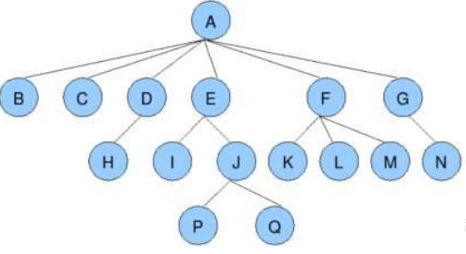  

**节点的度** ： 一个节点含有的子树的个数称为该节点的度； 如上图： A的为6，B的为0，D的为1。  
**叶节点或终端节点** ： 度为0的节点称为叶节点； 如上图： B、 C、 H、 I...等节点为叶节点 非终端。  
**节点或分支节点** ： 度不为0的节点。  
**双亲节点或父节点** ： 若一个节点含有子节点，则这个节点称为其子节点的父节点； 如上图： A是B的父节点。  
**孩子节点或子节点** ： 一个节点含有的子树的根节点称为该节点的子节点； 如上图： B是A的孩子节点。  
**兄弟节点** ： 具有相同父节点的节点互称为兄弟节点； 如上图： B、 C是兄弟节点。  
**树的度** ： 一棵树中，最大的节点的度称为树的度； 如上图：树的度为6。  
**节点的层次** ： 从根开始定义起，根为第1层，根的子节点为第2层，以此类推。  
**树的高度或深度** ： 树中节点的最大层次； 如上图：树的高度为4。  
**堂兄弟节点** ： 双亲在同一层的节点互为堂兄弟；如上图： H、 I互为兄弟节点。  
**节点的祖先** ： 从根到该节点所经分支上的所有节点；如上图： A是所有节点的祖先。  
**子孙** ： 以某节点为根的子树中任一节点都称为该节点的子孙。如上图：所有节点都是A的子孙。  
**森林** ： 由m（m>0）棵互不相交的树的集合称为森林。  

**树的表示** ： 树结构相对线性表比较复杂，存储表示起来比较麻烦，既然保存值域，也要保存结点和结点之间的关系。树有很多种表示方式如：双亲表示法，孩子表示法、孩子双亲表示法以及孩子兄弟表示法等。  

### 2. 双亲表示法(顺序存储结构)

优点：parent(tree, x)操作可以在常量时间内实现 

缺点：求结点的孩子时需要遍历整个结构  

用一组连续的存储空间来存储树的结点，同时在每个结点中附加一个指示器(整数域) ，用以指示双亲结点的位置(下标值) 。  

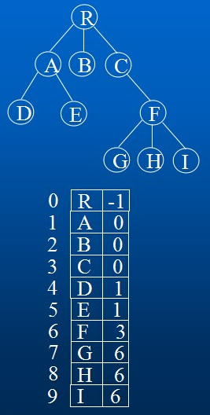  

图所示是一棵树及其双亲表示的存储结构。这种存储结构利用了任一结点的父结点唯一的性质。可以方便地直接找到任一结点的父结点，但求结点的子结点时需要扫描整个数组。  

```javascript
// 1.双亲表示法
// 优点：parent(tree, x)操作可以在常量时间内实现
// 缺点：求结点的孩子时需要遍历整个结构
function ParentTree() {
    this.nodes = [];
}
ParentTree.prototype = {
    constructor: ParentTree,
    getDepth: function () {
        var maxDepth = 0;

        for (var i = 0; i < this.nodes.length; i++) {
            var dep = 0;
            for (var j = i; j >= 0; j = this.nodes[i].parent) dep++;
            if (dep > maxDepth) maxDepth = dep;
        }

        return maxDepth;
    }
};
function ParentTreeNode(data, parent) {
    // type: ParentTree
    this.data = data || null;
    // 双亲位置域 {Number}
    this.parent = parent || 0;
}
var pt = new ParentTree();
pt.nodes.push(new ParentTreeNode('R', -1));
pt.nodes.push(new ParentTreeNode('A', 0));
pt.nodes.push(new ParentTreeNode('B', 0));
pt.nodes.push(new ParentTreeNode('C', 0));
pt.nodes.push(new ParentTreeNode('D', 1));
pt.nodes.push(new ParentTreeNode('E', 1));
pt.nodes.push(new ParentTreeNode('F', 3));
pt.nodes.push(new ParentTreeNode('G', 6));
pt.nodes.push(new ParentTreeNode('H', 6));
pt.nodes.push(new ParentTreeNode('I', 6));
```  

### 3. 孩子链表表示法 

树中每个结点有多个指针域，每个指针指向其一棵子树的根结点。有两种结点结构。  

#### 3.1 定长结点结构  

指针域的数目就是树的度。  

其特点是：链表结构简单，但指针域的浪费明显。结点结构如图所示。在一棵有n个结点，度为k的树中必有n(k-1)+1空指针域。  
        
  

#### 3.2 不定长结点结构  
  
树中每个结点的指针域数量不同，是该结点的度，如图所示。没有多余的指针域，但操作不便。  
        
  

#### 3.3 复合链表结构  

对于树中的每个结点，其孩子结点用带头结点的单链表表示，表结点和头结点的结构如图所示。  
n个结点的树有n个(孩子)单链表(叶子结点的孩子链表为空)，而n个头结点又组成一个线性表且以顺序存储结构表示。  

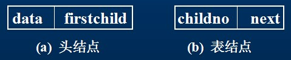  

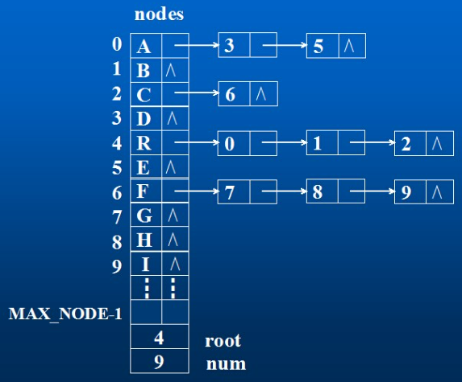  

```javascript
function ChildTree() {
    this.nodes = [];
}
ChildTree.prototype = {
    constructor: ChildTree,
    getDepth: function () {
        var self = this;
        return function subDepth(rootIndex) {
            if (!self.nodes[rootIndex]) return 1;

            for (var sd = 1, p = self.nodes[rootIndex]; p; p = p.next) {
                var d = subDepth(p.child);
                if (d > sd) sd = d;
            }

            return sd + 1;
        }(this.data[0]);
    }
};
/**
*
* @param {*} data
* @param {ChildTreeNode} firstChild 孩子链表头指针
* @constructor
*/
function ChildTreeBox(data, firstChild) {
    this.data = data;
    this.firstChild = firstChild;
}
/**
* 孩子结点
*
* @param {Number} child
* @param {ChildTreeNode} next
* @constructor
*/
function ChildTreeNode(child, next) {
    this.child = child;
    this.next = next;
}
```  

孩子表示法便于涉及孩子的操作的实现，但不适用于parent操作。  

### 4. 孩子兄弟表示法(二叉树表示法)

以二叉链表作为树的存储结构。  

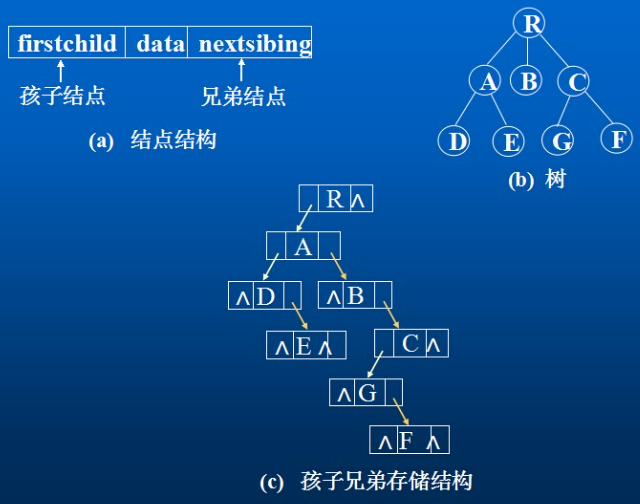  

两个指针域：分别指向结点的第一个子结点和下一个兄弟结点。结点类型定义如下：  

```javascript
// 孩子兄弟表示法(二叉树表示法)
// 可增设一个parent域实现parent操作
// 伪代码
function ChildSiblingTree(data, firstChild, nextSibling) {
    this.data = data || null;
    this.firstChild = firstChild || null;
    this.nextSibling = nextSibling || null;
}
ChildSiblingTree.prototype = {
    constructor: ChildSiblingTree,
    // 输出孩子兄弟链表表示的树的各边
    print: function print() {
        for (var child = this.firstChild; child; child = child.nextSibling) {
            console.log('%c %c', this.data, child.data);
            print.call(child);
        }
    },
    // 求孩子兄弟链表表示的树的叶子数目
    leafCount: function leafCount() {
        if (!this.firstChild) return 1;
        else {
            var count = 0;
            for (var child = this.firstChild; child; child = child.nextSibling) {
                count += leafCount.call(child);
            }
            return count;
        }
    },
    // 求树的度
    getDegree: function getDegree() {
        if (!this.firstChild) return 0;
        else {
            var degree = 0;
            for (var p = this.firstChild; p; p = p.nextSibling) degree++;

            for (p = this.firstChild; p; p = p.nextSibling) {
                var d = getDegree.call(p);
                if (d > degree) degree = d;
            }

            return degree;
        }
    },
    getDepth: function getDepth() {
        if (this === global) return 0;
        else {
            for (var maxd = 0, p = this.firstChild; p; p = p.nextSibling) {
                var d = getDepth.call(p);
                if (d > maxd) maxd = d;
            }

            return maxd + 1;
        }
    }
};
```  

### 5. 森林与二叉树的转换

由于二叉树和树都可用二叉链表作为存储结构，对比各自的结点结构可以看出，以二叉链表作为媒介以导出树和二叉树之间的一个对应关系。  

1. 从物理结构来看，树和二叉树的二叉链表是相同的，只是对指针的逻辑解释不同而已。  
2. 从树的二叉链表表示的定义可知，任何一棵和树对应的二叉树，其右子树一定为空。  
  
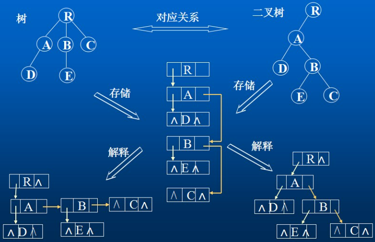  

#### 5.1 树转换成二叉树  

对于一般的树，可以方便地转换成一棵唯一的二叉树与之对应。将树转换成二叉树在“孩子兄弟示法”中已给出，其详细步骤是：  

1. 加虚线。在树的每层按从“左至右”的顺序在兄弟结点之间加虚线相连。  
2. 去连线。除最左的第一个子结点外，父结点与所有其它子结点的连线都去掉。  
3. 旋转。将树顺时针旋转450，原有的实线左斜。  
4. 整型。将旋转后树中的所有虚线改为实线，并向右斜。  
        
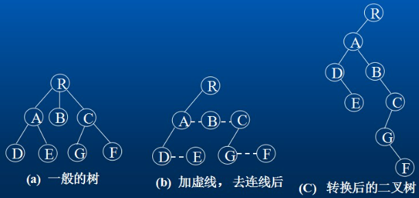

#### 5.2 二叉树转换成树  
        
对于一棵转换后的二叉树，如何还原成原来的树? 其步骤是：  

1. 加虚线。若某结点i是其父结点的左子树的根结点，则将该结点i的右子结点以及沿右子链不断地搜索所有的右子结点，将所有这些右子结点与i结点的父结点之间加虚线相连，如下图a所示。  
2. 去连线。去掉二叉树中所有父结点与其右子结点之间的连线，如下图b所示。  
3. 规整化。将图中各结点按层次排列且将所有的虚线变成实线，如下图c所示。  
        
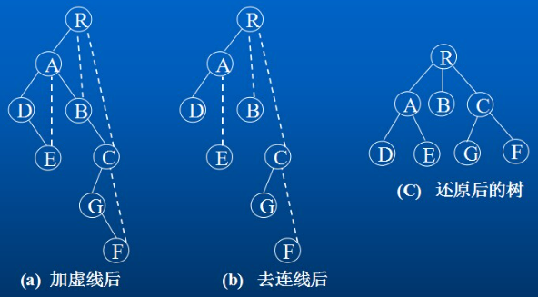  

#### 5.3 森林转换成二叉树  
        
当一般的树转换成二叉树后，二叉树的右子树必为空。若把森林中的第二棵树(转换成二叉树后)的根结点作为第一棵树(二叉树)的根结点的兄弟结点，则可导出森林转换成二叉树的转换算法如下：   

设F={T1, T2,⋯,Tn}是森林，则按以下规则可转换成一棵二叉树B=(root，LB，RB)  

1. 若n=0，则B是空树。  
2. 若n>0，则二叉树B的根是森林T1的根root(T1)，B的左子树LB是B(T11,T12, ⋯,T1m) ，其中T11,T12, ⋯,T1m是T1的子树(转换后)，而其右子树RB是从森林F’={T2, T3,⋯,Tn}转换而成的二叉树。  
        
转换步骤：  

1. 将F={T1, T2,⋯,Tn} 中的每棵树转换成二叉树。  
2. 按给出的森林中树的次序，从最后一棵二叉树开始，每棵二叉树作为前一棵二叉树的根结点的右子树，依次类推，则第一棵树的根结点就是转换后生成的二叉树的根结点。  

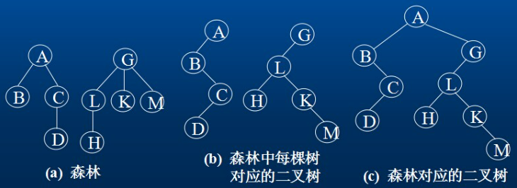  

#### 5.4 二叉树转换成森林  
        
若B=(root，LB，RB)是一棵二叉树，则可以将其转换成由若干棵树构成的森林：F={T1, T2,⋯,Tn} 。转换算法：  

1. 若B是空树，则F为空。  
2. 若B非空，则F中第一棵树T1的根root(T1)就是二叉树的根root， T1中根结点的子森林F1是由树B的左子树LB转换而成的森林；F中除T1外其余树组成的的森林F’={T2, T3,⋯,Tn} 是由B右子树RB转换得到的森林。  
        
    上述转换规则是递归的，可以写出其递归算法。以下给出具体的还原步骤。  

1. 去连线。将二叉树B的根结点与其右子结点以及沿右子结点链方向的所有右子结点的连线全部去掉，得到若干棵孤立的二叉树，每一棵就是原来森林F中的树依次对应的二叉树，如图(b)所示。  
2. 二叉树的还原。将各棵孤立的二叉树按二叉树还原为树的方法还原成一般的树，如图(c)所示。  
        
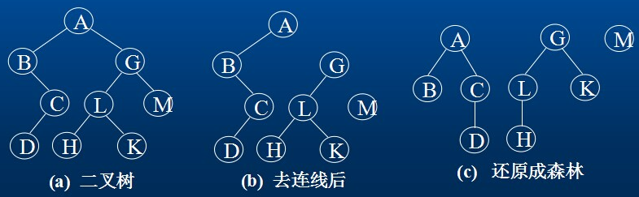  
    
### 6. 树和森林的遍历  

#### 6.1 树的遍历  

由树结构的定义可知，树的遍历有二种方法。  
        
1. 先序遍历：先访问根结点，然后依次先序遍历完每棵子树。如图的树，先序遍历的次序是： ABCDEFGIJHK  
2. 后序遍历：先依次后序遍历完每棵子树，然后访问根结点。如图的树，后序遍历的次序是： CDBFGIJHEKA  
        
    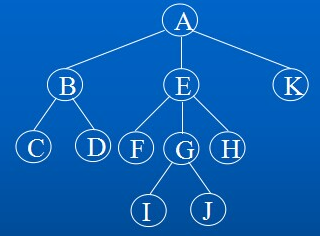  

说明：  

+ 树的先序遍历实质上与将树转换成二叉树后对二叉树的先序遍历相同。  
+ 树的后序遍历实质上与将树转换成二叉树后对二叉树的中序遍历相同。  

#### 6.2 森林的遍历  

设F={T1, T2,⋯,Tn}是森林，对F的遍历有二种方法。  

1. 先序遍历：按先序遍历树的方式依次遍历F中的每棵树。  
2. 中序遍历：按后序遍历树的方式依次遍历F中的每棵树。  
        
## 四. 二叉树  

二叉树是一种典型的树树状结构，每个节点最多有两个子树的树结构，通常子树被称作“左子树”和“右子树”。  

```javascript

```  